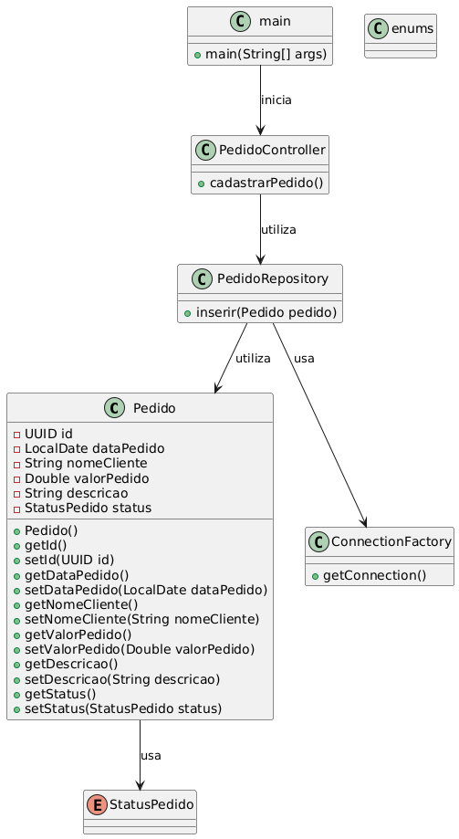

# Projeto Curso Java - Coti Informática

Este projeto é uma introdução ao mundo Java e à Programação Orientada a Objetos (POO).

## Explicação do Projeto

- **PedidoController**: Responsável por receber as informações inseridas pelo usuário, como nome do cliente, valor do produto, descrição e status do pedido.

- **Enums**: Classe que define os possíveis status do pedido: `PENDENTE`, `PROCESSANDO`, `ENVIADO`, `ENTREGUE`, `CANCELADO`.

- **PedidoRepository**: Abre a conexão com o banco de dados, executa a query de inserção do pedido e, ao final, fecha a conexão.

- **Pedido**: Classe que reúne os atributos de um pedido. Os atributos são privados e acessados por meio de métodos getters e setters, permitindo o reuso por outras classes.

- **ConnectionFactory**: Responsável por criar a conexão com o banco de dados.

Além disso, o projeto inclui um script chamado `scripts.sql`, que cria a tabela no PostgreSQL, e um arquivo `docker-compose.yml`, que configura um container com PostgreSQL.

